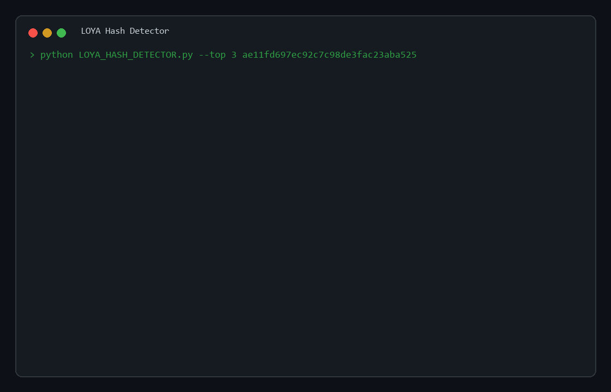

# LOYA Hash Detector v1.0.0 
[](https://python.org) [](#tested-platforms) [](Requirements.txt) [](#tested-platforms)



LOYA Hash Detector is a local Python CLI tool for identifying likely hash formats. It detects formats only. It does not crack hashes, verify passwords, execute Hashcat, execute John the Ripper, or run attack workflows.

## Requirements

- Python `>=3.10`
- No external runtime packages
- Works with Windows terminal, PowerShell, Linux terminal, and Kali Linux terminal
- `Requirements.txt` is intentionally empty because the project uses only the Python standard library

## Quick Start

Windows:
```powershell
python .\LOYA_HASH_DETECTOR.py --version
python .\LOYA_HASH_DETECTOR.py ae11fd697ec92c7c98de3fac23aba525
```

Linux and Kali Linux:
```bash
python3 LOYA_HASH_DETECTOR.py --version
python3 LOYA_HASH_DETECTOR.py ae11fd697ec92c7c98de3fac23aba525
```

Install dependencies only if your workflow expects a requirements step:
```bash
python3 -m pip install -r Requirements.txt
```

## Features

- Regex-based detector records with full-input matching
- Confidence scoring with strongest matches sorted first
- Match reasons for length, charset, prefix, separator, format, and mapping source
- Hashcat mode and John format hints when known
- Text output and JSON output
- Single-hash mode, file mode, direct absolute file path mode, and interactive menu mode
- `--top`, `--strict`, `--quiet`, `--version`, `--log-file`, and `--debug` CLI flags
- Optional JSONL operational logs for debugging
- Standard-library-only Python package

## Usage

Detect one hash:
```bash
python3 LOYA_HASH_DETECTOR.py ae11fd697ec92c7c98de3fac23aba525
```

Detect from a file:
```bash
python3 LOYA_HASH_DETECTOR.py --file hashes.txt
```

Detect from a full file path without `--file`:
```bash
python3 LOYA_HASH_DETECTOR.py /home/kali/hashes.txt
```

Print JSON:
```bash
python3 LOYA_HASH_DETECTOR.py --json ae11fd697ec92c7c98de3fac23aba525
```

Show fewer results:
```bash
python3 LOYA_HASH_DETECTOR.py --top 3 ae11fd697ec92c7c98de3fac23aba525
```

Use strict matching:
```bash
python3 LOYA_HASH_DETECTOR.py --strict ae11fd697ec92c7c98de3fac23aba525
```

Hide match details:
```bash
python3 LOYA_HASH_DETECTOR.py --quiet ae11fd697ec92c7c98de3fac23aba525
```

Write JSONL logs:
```bash
python3 LOYA_HASH_DETECTOR.py --log-file loya.log ae11fd697ec92c7c98de3fac23aba525
```

Run interactive menu:
```bash
python3 LOYA_HASH_DETECTOR.py
```

Interactive options:
```text
1) HASH
2) File Directory
3) Exit
```

## Windows Commands

The same commands work on Windows with `python` and backslash paths:
```powershell
python .\LOYA_HASH_DETECTOR.py --file .\hashes.txt
python .\LOYA_HASH_DETECTOR.py --json ae11fd697ec92c7c98de3fac23aba525
python .\LOYA_HASH_DETECTOR.py D:\scripts\HashTypeDetector\hashes.txt
```

## Output

Text output shows the detector name, confidence score, Hashcat hint, John hint, and short match reasons.

JSON output returns one object for a single hash and a list of objects for file mode.

## Tested Platforms

- Windows: `python .\tests\test_basic.py` passed with `24 tests passed`
- Windows: `python -m py_compile ...` passed
- Kali Linux WSL2: `python3 --version` returned `Python 3.13.7`
- Kali Linux WSL2: `python3 tests/test_basic.py` passed with `24 tests passed`
- Kali Linux WSL2: `python3 -m py_compile ...` passed
- Kali Linux WSL2: real CLI detection command ran successfully

Because the app uses only Python standard-library modules and no OS-specific APIs, the same code path works on Windows and Linux.

## Exit Codes

- `0`: success
- `1`: invalid CLI usage or unexpected runtime error
- `2`: file-related error

## Project Structure

```text
LOYA_HASH_DETECTOR.py
hashdetector/
  __init__.py
  cli.py
  core.py
  rules.py
tests/
  test_basic.py
Doc/
  loya-hash-detector-demo.gif
  v1.md
README.md
Requirements.txt
```

## Development

Run tests:
```bash
python3 tests/test_basic.py
```

Compile check:
```bash
python3 -m py_compile LOYA_HASH_DETECTOR.py hashdetector/__init__.py hashdetector/cli.py hashdetector/core.py hashdetector/rules.py tests/test_basic.py
```

Windows alternatives:
```powershell
python .\tests\test_basic.py
python -m py_compile .\LOYA_HASH_DETECTOR.py .\hashdetector\__init__.py .\hashdetector\cli.py .\hashdetector\core.py .\hashdetector\rules.py .\tests\test_basic.py
```

## Safety Scope

- Detection only
- No password cracking
- No credential verification
- No Hashcat execution
- No John the Ripper execution
- No attack automation

## Contribution Guidelines

- Keep Python code compact
- Do not add comments, docstrings, or blank-line-heavy formatting to Python files
- Keep detector records data-driven
- Use full-match regex patterns
- Add or update tests when behavior changes
- Keep the tool detection-only
- Verify Hashcat and John mapping hints against local builds before changing mappings

## Version

This build is `1.0.0`.
